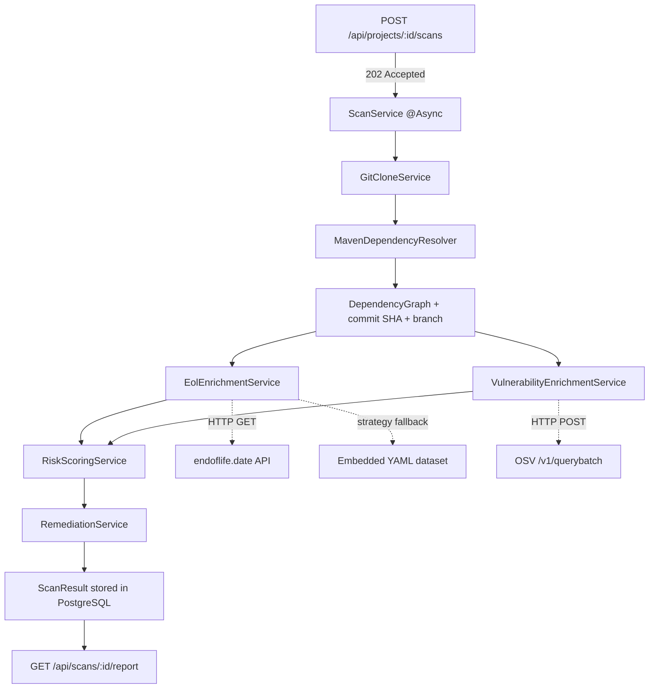

# DepGuard — Implementation Plan

## Problem Statement

Java/Maven projects accumulate outdated and vulnerable dependencies, but existing tools only tell you
*what* is vulnerable — not *how risky it actually is* to your application. DepGuard analyzes a
GitHub repository's dependency tree, enriches each dependency with EOL and advisory data, and
produces a risk-scored health report with remediation advice.

---

## Requirements

| # | Requirement |
|---|-------------|
| R1 | Spring Boot 4.x + Java 21 modular monolith from day one — no CLI phase |
| R2 | Input: public GitHub URLs only (`https://github.com/...`) — reject all other inputs |
| R3 | Clone via JGit over HTTPS (read-only) — never execute Maven builds from cloned repos |
| R4 | EOL data: endoflife.date REST API with extensible strategy-based mapping + hardcoded fallback |
| R5 | Advisory data: OSV `POST /v1/querybatch` live API (Maven ecosystem) |
| R6 | Scan execution: `@Async` — `POST /scans` returns `202 Accepted` immediately |
| R7 | Scan reproducibility: store commit SHA, branch, timestamps, data-source versions per scan |
| R8 | Risk model: Dependency Risk Heuristic — weighted combination of EOL + advisory severity + position |
| R9 | Risk levels: LOW / MEDIUM / HIGH / CRITICAL + `confidence` field on each assessment |
| R10 | Unknown EOL/advisory data must surface as `UNKNOWN` — never silently score as LOW |
| R11 | Remediation: recommend compatible upgrade paths, not blindly the latest version |
| R12 | PostgreSQL for persistence, Docker Compose from day one |
| R13 | 2–4 week timeline; optimize for interview depth over feature breadth |

---

## Background — Research Findings

### Maven Resolver API

Dependencies: `maven-resolver-api`, `maven-resolver-impl`, `maven-resolver-connector-basic`,
`maven-resolver-transport-http`, `maven-model-builder`

Apache's official programmatic API for resolving dependency trees outside of a plugin context.
Works standalone in Spring Boot 4.x / Java 21. Avoids manually parsing `pom.xml` and correctly
handles transitive deps, version conflict resolution, and scope. **No Maven binary or build
execution is required** — resolution reads POM metadata from Maven Central only.

### OSV API

`POST https://api.osv.dev/v1/querybatch` accepts up to 1,000 package queries in one call.

- Maven ecosystem key: `"Maven"`
- No authentication required
- Response includes `severity[]` array and `database_specific` CVSS data — prefer these over
  deriving severity independently
- Example payload:
  ```json
  {
    "queries": [
      {
        "package": { "name": "org.springframework:spring-core", "ecosystem": "Maven" },
        "version": "5.3.31"
      }
    ]
  }
  ```

### endoflife.date API

`GET https://endoflife.date/api/{product}/{cycle}.json`

Returns: `{ "eol": "2023-11-24", "lts": false, "releaseDate": "...", "latest": "..." }`

Relevant products: `spring-boot`, `spring-framework`, `tomcat`, `hibernate-orm`

Fallback dataset covers these same products as embedded YAML for resilience.
Product-to-groupId mapping is extensible via a `EolMappingStrategy` interface — not hardcoded
`if/else` chains.

---

## MVP Scope

The MVP delivers a working dependency intelligence REST API: register a project, trigger a scan,
get a risk-scored health report with remediation advice.

**In scope for MVP:**
- Public GitHub repos, Maven/pom.xml projects
- Full dependency tree resolution (direct + transitive)
- EOL enrichment via endoflife.date
- Advisory enrichment via OSV
- Dependency Risk Heuristic scoring
- Remediation recommendations
- Async scan execution (`@Async`, single JVM)
- Scan reproducibility metadata (commit SHA, branch, data-source timestamps)

**Explicitly out of scope until the core scanner is complete:**
- Kafka / event-driven pipeline
- React dashboard
- GitHub App / automated PR creation
- AI-assisted explanations
- Static reachability analysis

---

## Proposed Solution

A Spring Boot 4.x modular monolith with clean domain package boundaries. A REST API triggers scans.
`POST /api/projects/{id}/scans` returns `202 Accepted` immediately; the scan pipeline runs
asynchronously via `@Async` within the same JVM process, backed by a thread pool executor.

Each domain module is independently testable with its own service and repository layer. The
module boundaries are designed to slot into a Kafka event bus in a future phase without requiring
logic rewrites.

### Scan Pipeline



### Module Structure

```
src/main/java/io/depguard/
├── scan/
│   ├── ScanController.java
│   ├── ScanService.java            (@Async pipeline orchestrator)
│   ├── Scan.java                   (entity: includes commitSha, branch, dataSourceMetadata)
│   ├── ScanRepository.java
│   ├── ScanStatus.java             (enum: PENDING, RUNNING, COMPLETED, FAILED)
│   └── AsyncScanConfig.java        (ThreadPoolTaskExecutor configuration)
│
├── project/
│   ├── ProjectController.java
│   ├── ProjectService.java
│   ├── Project.java                (entity)
│   └── ProjectRepository.java
│
├── dependency/
│   ├── MavenDependencyResolver.java
│   ├── GitCloneService.java        (public GitHub HTTPS only — validated before clone)
│   ├── GitHubUrlValidator.java     (rejects non-github.com URLs)
│   ├── DependencyGraph.java
│   ├── ResolvedDependency.java     (record: groupId, artifactId, version, scope, direct)
│   ├── CloneResult.java            (record: localPath, commitSha, branch)
│   ├── Dependency.java             (entity)
│   ├── ScanDependency.java         (join entity)
│   └── DependencyRepository.java
│
├── eol/
│   ├── EolService.java
│   ├── EolClient.java
│   ├── EolMappingStrategy.java     (interface: maps groupId → product name)
│   ├── DefaultEolMappingStrategy.java  (loads from eol-mappings.yml)
│   ├── EolRecord.java              (entity: status, eolDate, source, dataSourceFetchedAt)
│   ├── EolStatus.java              (enum: SUPPORTED, MAINTENANCE, EOL, UNKNOWN)
│   └── EolRepository.java
│
├── vulnerability/
│   ├── VulnerabilityService.java
│   ├── OsvClient.java
│   ├── VulnerabilityRecord.java    (entity: replaces CveRecord — covers GHSA, CVE, OSV IDs)
│   ├── DependencyVulnerability.java (join entity)
│   ├── Severity.java               (enum: LOW, MEDIUM, HIGH, CRITICAL, UNKNOWN)
│   └── VulnerabilityRepository.java
│
├── risk/
│   ├── RiskScoringService.java
│   ├── RiskAssessment.java         (entity: heuristicScore, riskLevel, confidence, reasons)
│   ├── RiskLevel.java              (enum: LOW, MEDIUM, HIGH, CRITICAL, UNKNOWN)
│   ├── RiskConfidence.java         (enum: HIGH, MEDIUM, LOW)
│   ├── RiskRule.java
│   └── RiskRepository.java
│
├── remediation/
│   ├── RemediationService.java
│   ├── MavenCentralClient.java
│   ├── CompatibilityAdvisor.java   (knows about known breaking change boundaries)
│   ├── RemediationRecommendation.java (entity)
│   └── RemediationRepository.java
│
└── infrastructure/
    ├── WebClientConfig.java
    ├── EolFallbackProperties.java
    └── GlobalExceptionHandler.java
```

---

## Task Breakdown

### Task 1 — Project Bootstrap: Spring Boot 4.x skeleton with Docker Compose

**Objective:** Establish a working, runnable Spring Boot 4.x + Java 21 application with PostgreSQL
wired up via Docker Compose. Set the correct package structure and domain module layout from day one.

**Implementation Guidance:**

- Set up `pom.xml` with the Spring Boot 4.x parent BOM. Add:
  - `spring-boot-starter-web`
  - `spring-boot-starter-data-jpa`
  - `postgresql` (runtime)
  - `flyway-core`
  - `lombok`
  - `spring-boot-starter-test`
  - `springdoc-openapi-starter-webmvc-ui`
- Java compiler source/target: `21`
- Create `docker-compose.yml` with:
  - `postgres:16` service with health check
  - `depguard` Spring Boot service depending on postgres
  - Environment variables for DB connection (`DB_URL`, `DB_USERNAME`, `DB_PASSWORD`)
- Create the package skeleton under `io.depguard`: `scan`, `project`, `dependency`, `eol`,
  `vulnerability`, `risk`, `remediation`, `infrastructure`
- Add Flyway migration `V1__init.sql` with core tables: `projects`, `scans`, `dependencies`,
  `scan_dependencies`
- Add `GET /api/health` endpoint returning `{ "status": "UP" }`

**Tests:**
- Integration test that starts the Spring context and asserts `GET /api/health` returns HTTP 200

**Demo:**
```bash
docker compose up
curl http://localhost:8080/api/health
# → { "status": "UP" }
```

---

### Task 2 — Project Management API

**Objective:** Allow users to register a public GitHub repository as a "project" that can be scanned.

**Implementation Guidance:**

- `Project` entity fields: `id` (UUID), `name`, `repositoryUrl`, `defaultBranch`, `createdAt`
- `ProjectRepository` extends `JpaRepository<Project, UUID>`
- `ProjectService` methods: `createProject(CreateProjectRequest)`, `getProject(UUID)`, `listProjects()`
- `ProjectController` endpoints:
  - `POST /api/projects` → `201 Created` with project JSON
  - `GET /api/projects` → list of all projects
  - `GET /api/projects/{id}` → single project or `404`
- `GitHubUrlValidator` enforced at project creation:
  - Must match `https://github.com/{owner}/{repo}` pattern
  - Reject `http://`, non-github.com domains, and private-looking paths
  - Return `400 Bad Request` with a clear error message if validation fails
- Flyway migration `V2__projects.sql`

**Tests:**
- Unit tests for `ProjectService` with mocked repository
- `MockMvc` integration tests: create with valid URL, create with invalid URL (assert 400), retrieve, list
- Assert that non-GitHub URLs are rejected at the API layer

**Demo:**
```bash
curl -X POST http://localhost:8080/api/projects \
  -H 'Content-Type: application/json' \
  -d '{ "name": "payment-service", "repositoryUrl": "https://github.com/user/payment-service" }'
# → 201 Created  { "id": "...", "name": "payment-service", ... }

curl -X POST http://localhost:8080/api/projects \
  -H 'Content-Type: application/json' \
  -d '{ "name": "bad", "repositoryUrl": "https://gitlab.com/user/repo" }'
# → 400 Bad Request  { "error": "VALIDATION_ERROR", "message": "Only public GitHub URLs are accepted" }
```

---

### Task 3 — Maven Dependency Tree Resolution

**Objective:** Clone a public GitHub repo (read-only, HTTPS) and resolve its complete Maven
dependency tree (direct + transitive) programmatically — without executing any Maven build.

**Implementation Guidance:**

- Add Maven Resolver dependencies to `pom.xml`:
  - `maven-resolver-api:1.9.x`
  - `maven-resolver-impl:1.9.x`
  - `maven-resolver-connector-basic:1.9.x`
  - `maven-resolver-transport-http:1.9.x`
  - `maven-model-builder:3.9.x`
  - `org.eclipse.jgit:7.x`
- `GitCloneService`:
  - Validates URL via `GitHubUrlValidator` before cloning
  - Clones via JGit using `CloneCommand` over HTTPS (no credentials, public repos only)
  - Returns `CloneResult { localPath, commitSha, branch }` — commit SHA captured at clone time
    for reproducibility
  - Deletes the temp directory in a `finally` block
- `MavenDependencyResolver`:
  - Accepts a local path to a directory containing `pom.xml`
  - Uses `RepositorySystem` + `DefaultRepositorySystemSession` to resolve the dependency tree
    **from Maven Central only** — no local `mvn` command, no build execution
  - Returns `List<ResolvedDependency>` — each a record of `groupId`, `artifactId`, `version`,
    `scope`, `direct`
- `DependencyGraph`: internal model capturing parent-child relationships
- This module is kept pure — no DB writes, returns domain objects only

**Tests:**
- `src/test/resources/test-pom.xml` — a minimal Spring Boot project pom checked into the repo
- Unit test asserts direct deps are flagged `direct=true`, transitive deps `direct=false`
- Assert all versions are non-null and scopes are present
- Unit test `GitHubUrlValidator`: assert valid and invalid URLs behave correctly

**Demo:**
```bash
# Triggered by test — output to stdout:
# commitSha: a3f9d1c...
# branch: main
# [DIRECT]     org.springframework.boot:spring-boot-starter-web:3.3.0  [compile]
# [TRANSITIVE] org.springframework:spring-core:6.1.0                   [compile]
# ...
```

---

### Task 4 — Async Scan Orchestration and Dependency Persistence

**Objective:** Wire the scan trigger (`POST /api/projects/{id}/scans`) to the dependency resolver.
Return `202 Accepted` immediately; run the pipeline asynchronously. Persist all dependency data
including scan reproducibility metadata.

**Implementation Guidance:**

- `Scan` entity fields: `id` (UUID), `projectId`, `status` (enum), `commitSha`, `branch`,
  `startedAt`, `completedAt`, `errorMessage`
- `Dependency` entity: `id` (UUID), `groupId`, `artifactId`, `version`, `ecosystem` (default: `MAVEN`)
- `ScanDependency` join entity: `scanId`, `dependencyId`, `scope`, `direct` (boolean)
- `AsyncScanConfig`: configures a `ThreadPoolTaskExecutor` (core pool size 4, max 10, named
  `scan-executor-*`) used exclusively for scan pipelines
- `ScanService.triggerScan(projectId)` — annotated `@Async("scanExecutor")`:
  1. Looks up the project
  2. Updates `Scan` record to `RUNNING`
  3. Calls `GitCloneService` → captures `commitSha` + `branch` → stores on the `Scan` record
  4. Calls `MavenDependencyResolver` → returns dependency list
  5. Persists all `Dependency` and `ScanDependency` records
  6. Proceeds to EOL + CVE enrichment (Task 5/6)
  7. Marks scan `COMPLETED` — or `FAILED` on exception
- `ScanController`:
  - `POST /api/projects/{id}/scans` → creates `Scan` record with status `PENDING`, fires `@Async`,
    returns `202 Accepted` with `{ "scanId": "..." }` immediately
  - `GET /api/scans/{id}` → returns scan status, `commitSha`, `branch`, `startedAt`,
    `completedAt`, and dependency list when COMPLETED
- Flyway migration `V3__scans_and_dependencies.sql` (includes `commit_sha`, `branch` columns on `scans`)

**Tests:**
- Integration test: create project → `POST` scan → assert immediate `202` response →
  poll `GET /api/scans/{id}` until `COMPLETED` → assert `commitSha` is non-null,
  `branch` is non-null, dependency count > 0

**Demo:**
```bash
curl -X POST http://localhost:8080/api/projects/{id}/scans
# → 202 Accepted immediately  { "scanId": "abc-123" }

# Poll until COMPLETED:
curl http://localhost:8080/api/scans/abc-123
# → { "status": "COMPLETED", "commitSha": "a3f9d1c...", "branch": "main",
#     "dependencyCount": 47, "dependencies": [...] }
```

---

### Task 5 — EOL Enrichment

**Objective:** For each dependency in a scan, determine its EOL status using an extensible
strategy-based product mapping — not hardcoded `if/else` logic.

**Implementation Guidance:**

- `EolMappingStrategy` interface:
  ```java
  interface EolMappingStrategy {
      Optional<ProductCycle> resolve(String groupId, String artifactId, String version);
  }
  ```
  - `DefaultEolMappingStrategy`: loads mappings from `eol-mappings.yml` at startup
  - New product support added by editing the YAML — no code changes required
  - `eol-mappings.yml` format:
    ```yaml
    mappings:
      - groupIdPrefix: "org.springframework.boot"
        product: "spring-boot"
      - groupIdPrefix: "org.springframework"
        product: "spring-framework"
      - groupIdPrefix: "org.hibernate"
        product: "hibernate-orm"
      - groupIdPrefix: "org.apache.tomcat"
        product: "tomcat"
    ```
  - Cycle extracted from version `major.minor` (e.g., `2.7.18` → `2.7`)
- `EolClient`: Spring `WebClient` calling `GET https://endoflife.date/api/{product}/{cycle}.json`
  - Maps response to `EolInfo { eolDate, isEol, status }`
  - Returns `Optional.empty()` on 404 — product not in endoflife.date → `UNKNOWN`
  - 5-second timeout with 1 retry (500ms delay)
  - Records `dataSourceFetchedAt` timestamp on success for reproducibility
- `EolService.enrichScan(scanId)`:
  - For each dependency: resolve product/cycle via `EolMappingStrategy`
  - If no mapping → `EolRecord { status=UNKNOWN, source=NO_MAPPING }`
  - If mapping found → call `EolClient`, fall back to embedded YAML on failure
  - **Do not treat `UNKNOWN` as LOW risk** — surfaces explicitly in the risk engine
- `EolRecord` entity: `id`, `dependencyId`, `scanId`, `status` (enum), `eolDate`, `source`
  (API / FALLBACK / NO_MAPPING), `dataSourceFetchedAt`

**Tests:**
- `EolClient` unit test using `MockWebServer`
- `DefaultEolMappingStrategy` unit test: assert correct product/cycle resolution; assert
  unrecognised groupId returns `Optional.empty()`
- Integration test: scan with Spring Boot `2.7.x` → assert `EolRecord.status = EOL`
- Unit test: dependency with no mapping → `EolRecord.status = UNKNOWN`, `source = NO_MAPPING`

**Demo:**
```bash
curl http://localhost:8080/api/scans/abc-123
# { "artifactId": "spring-boot-starter", "version": "2.7.18", "eolStatus": "EOL" }
# { "artifactId": "some-unknown-lib", "version": "1.0.0",     "eolStatus": "UNKNOWN" }
```

---

### Task 6 — Advisory Enrichment via OSV

**Objective:** For each dependency, query the OSV API for known advisories and persist them.
Use OSV-provided severity as the primary source; apply deterministic fallback only when needed.

**Implementation Guidance:**

- `OsvClient`:
  - Calls `POST https://api.osv.dev/v1/querybatch` with all scan dependencies in one batch
  - Payload: `{ "queries": [{ "package": { "name": "groupId:artifactId", "ecosystem": "Maven" },
    "version": "x.y.z" }] }`
  - Handles pagination via `next_page_token`
- Severity derivation — in priority order:
  1. `severity[].score` field in the OSV response (CVSS v3 or v4 string, e.g., `"CVSS:3.1/AV:N/...`)
  2. `database_specific.severity` field (e.g., `"HIGH"`)
  3. CVSS numerical score from `affected[].ecosystem_specific`
  4. If none present → `Severity.UNKNOWN` (never silently default to MEDIUM)
- `VulnerabilityRecord` entity (renamed from `CveRecord`):
  - `id`, `osvId` (covers GHSA-*, CVE-*, OSV-* IDs), `summary`, `severity`, `cvssScore`,
    `cvssVector`, `publishedAt`, `dataSourceFetchedAt`
  - `osvId` is the canonical identifier — not limited to CVE IDs
- `DependencyVulnerability` join: `dependencyId`, `vulnerabilityRecordId`
- `VulnerabilityService.enrichScan(scanId)`:
  - Invokes `OsvClient` with all scan dependencies
  - Maps each OSV result to a `VulnerabilityRecord` using the priority severity derivation above
  - Records `dataSourceFetchedAt` on each record for reproducibility
- Integrate into `ScanService`: run EOL and advisory enrichment in parallel via
  `CompletableFuture.allOf()`
- Flyway migration `V4__vulnerabilities.sql`

**Tests:**
- `OsvClient` unit test with `MockWebServer` — verify correct batch payload formation
- Severity derivation unit test: OSV response with CVSS vector → correct severity; with
  `database_specific.severity` only → correct severity; with neither → `UNKNOWN`
- Integration test: scan known-vulnerable dependency → assert `VulnerabilityRecord` persisted
  with non-null `osvId`

**Demo:**
```bash
curl http://localhost:8080/api/scans/abc-123
# { "artifactId": "jackson-databind", "version": "2.13.0",
#   "advisories": [{ "osvId": "GHSA-...", "severity": "HIGH", "cvssScore": 7.5 }] }
```

---

### Task 7 — Dependency Risk Heuristic

**Objective:** Combine EOL status, advisory severity, and dependency position into a per-dependency
Dependency Risk Heuristic score. Surface `UNKNOWN` data explicitly — never treat it as LOW.

**Implementation Guidance:**

- Rename concept throughout: "risk score" → **Dependency Risk Heuristic**. Field names:
  `heuristicScore`, `riskLevel`, `confidence`
- `RiskRule` — weighted scoring:

  | Factor | Points |
  |--------|--------|
  | EOL | +30 |
  | MAINTENANCE | +10 |
  | Advisory CRITICAL | +40 |
  | Advisory HIGH | +30 |
  | Advisory MEDIUM | +15 |
  | Advisory LOW | +5 |
  | Advisory UNKNOWN severity | +20 (treat as conservatively elevated, not ignored) |
  | Direct dependency | × 1.0 |
  | Transitive dependency | × 0.6 |

- EOL `UNKNOWN` handling:
  - If EOL status is `UNKNOWN` (no mapping, API down) → **do not add EOL points**, but record
    `confidence = LOW` on the assessment
  - The `UNKNOWN` status surfaces in the report so engineers can investigate manually
- Advisory `UNKNOWN` severity: score +20 points and flag `confidence = MEDIUM`
- Risk buckets:

  | Score | Risk Level |
  |-------|------------|
  | 0–20 | LOW |
  | 21–40 | MEDIUM |
  | 41–70 | HIGH |
  | 71+ | CRITICAL |

- `confidence` on `RiskAssessment`:
  - `HIGH` — all EOL and advisory data was resolved successfully
  - `MEDIUM` — advisory severity for at least one finding was `UNKNOWN`
  - `LOW` — EOL status was `UNKNOWN` for this dependency; score may be understated

- `RiskScoringService.scoreScan(scanId)`:
  - Loads EOL records and advisory records for each dependency
  - Applies `RiskRule` weights; derives `confidence` from data completeness
  - Persists `RiskAssessment { heuristicScore, riskLevel, confidence, reasons }`
- `RiskAssessment` entity: `id`, `scanId`, `dependencyId`, `riskLevel`, `heuristicScore`,
  `confidence`, `reasons` (JSONB array of contributing factor strings)
- Flyway migration `V5__risk_assessments.sql`

**Tests:**
- Unit test each risk bucket boundary (scores 20, 21, 40, 41, 70, 71)
- Assert direct dep scores higher than equivalent transitive dep
- Assert `EOL=UNKNOWN, no advisories` → `riskLevel=LOW`, `confidence=LOW` (not silently LOW with no flag)
- Assert `advisory severity=UNKNOWN` → `confidence=MEDIUM`, score includes +20 points

**Demo:**
```bash
curl http://localhost:8080/api/scans/abc-123/report
# { "artifactId": "spring-boot-starter", "version": "2.7.18",
#   "riskLevel": "CRITICAL", "heuristicScore": 72, "confidence": "HIGH",
#   "riskReasons": ["EOL (+30)", "Advisory HIGH (+30)", "direct (×1.0)"] }
#
# { "artifactId": "some-unknown-lib", "version": "1.0.0",
#   "riskLevel": "LOW", "heuristicScore": 0, "confidence": "LOW",
#   "riskReasons": ["EOL status unknown — manual review recommended"] }
```

---

### Task 8 — Remediation Recommendations

**Objective:** For HIGH/CRITICAL risk dependencies, recommend a compatible upgrade path — not
blindly the latest version.

**Implementation Guidance:**

- `MavenCentralClient`:
  - Calls `GET https://search.maven.org/solrsearch/select?q=g:{groupId}+AND+a:{artifactId}&rows=20&wt=json`
  - Returns candidate versions sorted by release date descending
- `CompatibilityAdvisor`:
  - Encodes known major breaking change boundaries per product:
    - Spring Boot: `2.x → 3.x` requires `javax → jakarta` namespace migration + Java 17+
    - Hibernate: `5.x → 6.x` requires `javax.persistence → jakarta.persistence`
    - Spring Framework: `5.x → 6.x` requires Jakarta EE 9+
  - `isCompatibleUpgrade(current, candidate)`: returns `true` if the upgrade is within the
    same major version (same breaking change boundary), `false` if it crosses one
- `RemediationService.generateRecommendations(scanId)`:
  - For each HIGH/CRITICAL `RiskAssessment`:
    1. Fetch candidate versions from Maven Central
    2. Filter candidates against EOL data — `recommendedVersion` must not itself be EOL
    3. Prefer the **latest patch/minor within the same major** as a first recommendation
       (compatible, low breaking-change risk)
    4. If no supported version exists within the same major, offer the latest supported
       version in the next major — annotated as requiring migration
    5. Set `confidence = HIGH` when a same-major supported version is found; `MEDIUM` when
       a cross-major migration is the only option
- `RemediationRecommendation` entity: `id`, `scanId`, `dependencyId`, `currentVersion`,
  `recommendedVersion`, `upgradeType` (PATCH / MINOR / MAJOR), `breakingChangeSummary`,
  `reason`, `confidence`
- Expose via `GET /api/scans/{id}/recommendations`
- Flyway migration `V6__remediation.sql`

**Tests:**
- Unit test: Spring Boot `2.7.18` → recommendation is within `2.7.x` latest patch if still
  supported, otherwise `3.x` with `upgradeType=MAJOR` and `breakingChangeSummary` set
- Assert `recommendedVersion` is never itself EOL
- Assert cross-major recommendations have `upgradeType=MAJOR` and non-empty `breakingChangeSummary`

**Demo:**
```bash
curl http://localhost:8080/api/scans/abc-123/recommendations
# [
#   { "artifactId": "spring-boot-starter", "currentVersion": "2.7.18",
#     "recommendedVersion": "3.4.1", "upgradeType": "MAJOR",
#     "breakingChangeSummary": "javax → jakarta namespace migration required; Java 17+ required",
#     "reason": "Current version is EOL. No supported 2.x release available.",
#     "confidence": "MEDIUM" }
# ]
```

---

### Task 9 — Report API and Polish

**Objective:** Consolidate all scan data into a single, well-structured report endpoint that is
interview-demo-ready and exposes scan reproducibility metadata.

**Implementation Guidance:**

- `GET /api/scans/{id}/report` returns a complete `ScanReportDto`:
  ```json
  {
    "scanId": "7c9e6679-7425-40de-944b-e07fc1f90ae7",
    "projectName": "payment-service",
    "repositoryUrl": "https://github.com/user/payment-service",
    "commitSha": "a3f9d1c8b2e4f6a0d5c7e9f1b3a5d7e9c1a3b5d7",
    "branch": "main",
    "scannedAt": "2026-09-21T16:00:00Z",
    "overallHealth": "HIGH",
    "dataSources": {
      "eolApi": "endoflife.date",
      "eolFetchedAt": "2026-09-21T16:01:12Z",
      "advisoryApi": "api.osv.dev",
      "advisoryFetchedAt": "2026-09-21T16:01:15Z"
    },
    "summary": {
      "totalDependencies": 47,
      "eolCount": 5,
      "vulnerableCount": 3,
      "criticalCount": 1,
      "highCount": 2,
      "mediumCount": 4,
      "lowCount": 35,
      "unknownEolCount": 8
    },
    "dependencies": [
      {
        "groupId": "org.springframework.boot",
        "artifactId": "spring-boot-starter",
        "version": "2.7.18",
        "direct": true,
        "scope": "compile",
        "eolStatus": "EOL",
        "eolDate": "2023-11-24",
        "advisories": [
          { "osvId": "GHSA-xxxx-yyyy-zzzz", "summary": "...", "severity": "HIGH", "cvssScore": 7.5 }
        ],
        "riskLevel": "CRITICAL",
        "heuristicScore": 72,
        "confidence": "HIGH",
        "riskReasons": ["EOL (+30)", "Advisory HIGH (+30)", "direct (×1.0)"],
        "recommendation": {
          "recommendedVersion": "3.4.1",
          "upgradeType": "MAJOR",
          "breakingChangeSummary": "javax → jakarta namespace migration required",
          "reason": "Current version is EOL.",
          "confidence": "MEDIUM"
        }
      }
    ]
  }
  ```
- Error handling:
  - `404` for unknown scan ID
  - `409 Conflict` if scan status is still `RUNNING` or `PENDING`
  - Consistent error body: `{ "error": "...", "message": "...", "timestamp": "..." }`
- `springdoc-openapi` annotated with `@Operation` and `@ApiResponse` on all controllers
- Swagger UI at `http://localhost:8080/swagger-ui.html`

**Tests:**
- Full integration test: create project → trigger scan → poll until COMPLETED → call report
  → assert `commitSha` non-null, `dataSources` populated, at least one dependency with
  EOL/advisory/risk fields populated

**Demo:**
```bash
curl http://localhost:8080/api/scans/abc-123/report | jq .
# Complete reproducible report with commitSha, data-source timestamps, confidence flags
```

---

### Task 10 — RFC Document and README

**Objective:** Write the engineering RFC and project README that make this credible as a portfolio
piece and give you structured talking points for interviews.

**Implementation Guidance:**

- `RFC-0001-depguard.md` covering: Problem, Goals, Non-goals, Architecture, Dependency graph model,
  EOL detection + extensible mapping strategy, Advisory correlation + severity derivation,
  Dependency Risk Heuristic (with scoring rationale + unknown data handling), Scan reproducibility,
  Git security controls, Data model, API contract, Failure handling, Scalability (sync → `@Async` →
  Kafka), Future roadmap (reachability → GitHub PRs → AI), Alternatives Considered
- `README.md`: what it does, `docker compose up` quickstart, example API calls, architecture
  diagram, tech stack, roadmap

**Demo:**
A recruiter or engineer can open the GitHub repo, read the README, run `docker compose up`,
and hit the report endpoint within 5 minutes. The RFC demonstrates engineering depth.

---

## Delivery Milestones

| Week | Tasks | Deliverable |
|------|-------|-------------|
| Week 1 | Tasks 1–3 | Running app, project API, dependency tree resolved, GitHub URL validation |
| Week 2 | Tasks 4–6 | Async scan pipeline, EOL enrichment (strategy-based), advisory enrichment |
| Week 3 | Tasks 7–8 | Dependency Risk Heuristic, remediation with compatible upgrade paths |
| Week 4 | Tasks 9–10 | Polished report with reproducibility metadata, RFC, README, GitHub-ready |

---

## Future Phases (post-MVP)

| Phase | Description |
|-------|-------------|
| Phase 5 | Kafka event-driven scan pipeline |
| Phase 6 | React + TypeScript dashboard |
| Phase 7 | Static reachability analysis (VEX-style) |
| Phase 8 | GitHub App + automated remediation PRs |
| Phase 9 | AI-assisted CVE explanation and upgrade guidance |
